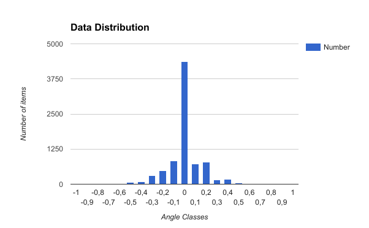
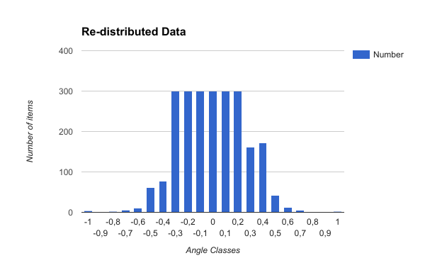
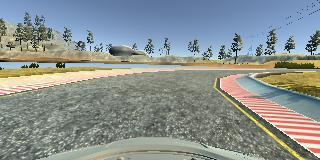
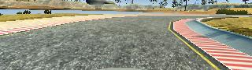
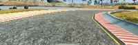
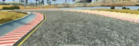
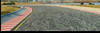

# **Behavioral Cloning** 

## Writeup

**Behavioral Cloning Project**

The goals / steps of this project are the following:
* Use the simulator to collect data of good driving behavior
* Build, a convolution neural network in Keras that predicts steering angles from images
* Train and validate the model with a training and validation set
* Test that the model successfully drives around track one without leaving the road
* Summarize the results with a written report

## Rubric Points
### Here I will consider the [rubric points](https://review.udacity.com/#!/rubrics/432/view) individually and describe how I addressed each point in my implementation.  

---
### Files Submitted & Code Quality

#### 1. Submission includes all required files and can be used to run the simulator in autonomous mode

My project includes the following files:
* model.py containing the script to create and train the model
* helpers.py containing data loading, analysis, normalization and augmentation functions
* drive.py for driving the car in autonomous mode
* model.h5 containing a trained convolution neural network 
* writeup_report.md summarizing the results

#### 2. Submission includes functional code
Using the Udacity provided simulator and my drive.py file, the car can be driven autonomously around the track by executing 
```sh
./drive.py model.h5
```

#### 3. Submission code is usable and readable

The model.py file contains the code for training and saving the convolution neural network. The file shows the pipeline I used for training and validating the model, and it contains comments to explain how the code works.

I also added helpers.py file to split configuration, network architecture and training code with exact implementation of methods. This file also contain generator function so data is normalized during training process.

### Model Architecture and Training Strategy

#### 1. An appropriate model architecture has been employed

I choose Nvidia model architecture as a starting point for this project.

The model includes ELU layers for activations. Data is normalized partially in the data generator (cropping, resizing), partialy in the keras lambda layer (zero-centering).

#### 2. Attempts to reduce overfitting in the model

I first start using just dropout layers for the model but later come to L2 regularization. It requires much more iterations to reach reasonable training accuracy but car performs smoothly with this layers.

The model was trained and validated on different data sets to ensure that the model was not overfitting. The model was tested by running it through the simulator and ensuring that the vehicle could stay on the track.

#### 3. Model parameter tuning

The model used an adam optimizer, so the learning rate was not tuned manually.

#### 4. Appropriate training data

Training data was chosen to keep the vehicle driving on the road. I used a combination of center lane driving, recovering from the left and right sides of the road. 

First I checked data distribution. We had much more data with 0 angles or angles around zero. 
Here is a graph which illustrates initial situation:



I decide to limit the amount of each data class to 300 samples so there will be no outstanding data. Here is distribution after this procedure:



For details about how I created the training data, see the next section. 

### Model Architecture and Training Strategy

#### 1. Solution Design Approach

My first step was to use a convolution neural network model similar to the Nvidia model. As Nvidia utilise it for self-driving cars it sounds reasonable to start with this work as well.

In order to gauge how well the model was working, I split my image and steering angle data into a training and validation set. I found that my first model had a low mean squared error on the training set but a high mean squared error on the validation set. This implied that the model was overfitting.

To combat the overfitting, I modified the model and added Dropout layers with .5 probability at the begining. 
This allowed reduce my accuration error to ~0.0070. However the car driving was rough.

After some time I tried L2 regularization in pair with dropout.
This gave me an underfitting and .150 accuracy in 25 epoches but car performed much smoother on the road.  

There were a few spots where the vehicle fell off the track. To improve the driving behavior in these cases, I collected several datasets for those sections of the road and fine-tune the model on these data

At the end of the process, the vehicle is able to drive autonomously around the track without leaving the road.

#### 2. Final Model Architecture

The final model architecture consisted of a convolution neural network with the following layers and layer sizes:

| Layer (type)  | Output Shape | Param # |
| ------------- |:------------:| -------:|
| Lambda        | 66, 200, 3   |       0 |
| Convolution2D | 31, 98, 24   |    1824 |
| Convolution2D | 14, 47, 36   |   21636 |
| Convolution2D | 5, 22, 48    |   43248 |
| Convolution2D | 3, 20, 64    |   27712 |
| Convolution2D | 1, 18, 64    |   36928 |
| Flatten       | 1152         |       0 |
| Dense         | 100          |  115300 |
| Dropout       | 100          |       0 |
| Dense         | 50           |    5050 |
| Dropout       | 50           |       0 |
| Dense         | 10           |     510 |
| Dropout       | 10           |       0 |
| Dense         | 1            |      11 |

Total params: 252,219

Trainable params: 252,219

Non-trainable params: 0

#### 3. Creation of the Training Set & Training Process

My first approach was to get udacity dataset, generate my own dataset and train on both in pair. Somewhy these gave a lot of problems and tons of spent time.
So next I trained on udacity dataset and fine-tune on my datasets.
For each of problematic regions I drive 3-4 times with different car position relatively to the side of the road. I tried to give neural network more data on how it should perform in different cases rather then just driving the center of the road.

Before further processing i'm shuffling the data.
I put 20% of the data into a validation set. For each data set I run normalization but augmentation is run only for training dataset.

For each iteration over training i'm running augmentation from side cameras which is giving 2 extra images per input image.

**Original Image**



##### Normalization steps

**Cropped**

Crop images to remove upper part of the picture with unnecessary data.



**Resized**

Resize images as per Nvidia architecture. Actually we could resize it even smaller - it will still work and will consume less resources.



I also converted images to YUV colorspace as per Nvidia recommendations.

Pre-normalization allow us to work with smaller arrays while augmentation process. 

In addition to this I applied augmentation techniques to the training set. Each technique applied with 50% probability to the image. This should add more variants to the training data and as a result teach car to behave better in different conditions.

##### Augmentation steps

**Random Flipping**

Image is flipped by vertical axis. Angle is flipped as well.



**Random Shifting**

Shift image randomly across x axis, changin angle 0.04 per pixel. Shifting image randomly across y angle (to simulate hills). Leave angle as is in this case.



After the collection process, I augment data up to 64000 samples of images for each epoch. 
Then preprocessed this data by zero-centering them.

I used this training data for training the model. The validation set helped determine if the model was over or under fitting. The ideal number of epochs was 25 (with batch size of 256) + 2 fine-tuning iteration 3 epoches each. 
I used an adam optimizer so that manually training the learning rate wasn't necessary.